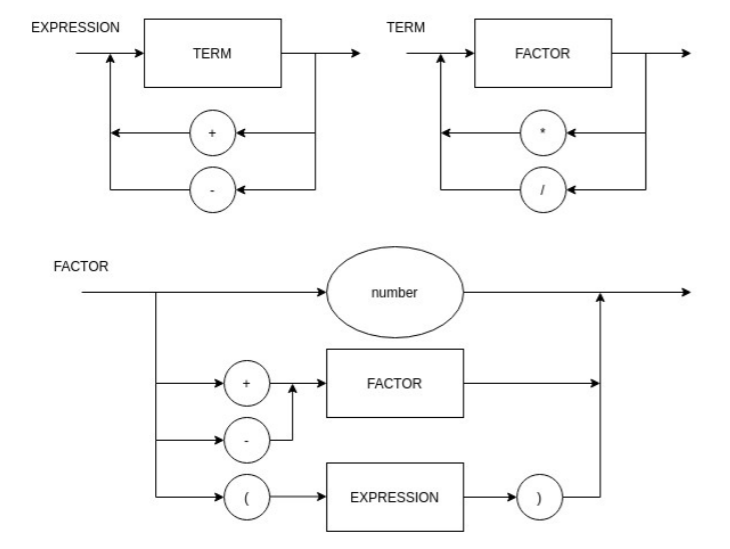
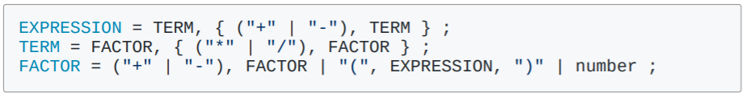

# Logica-Computacao

**Como rodar:**

`python main.py "operação"`

**Exemplo**:

`python main.py "1+1"`

## Diagrama Sintático para "+", "-", "*", "/" e "()"

## EBNF para "+", "-", "*", "/" e "()"

